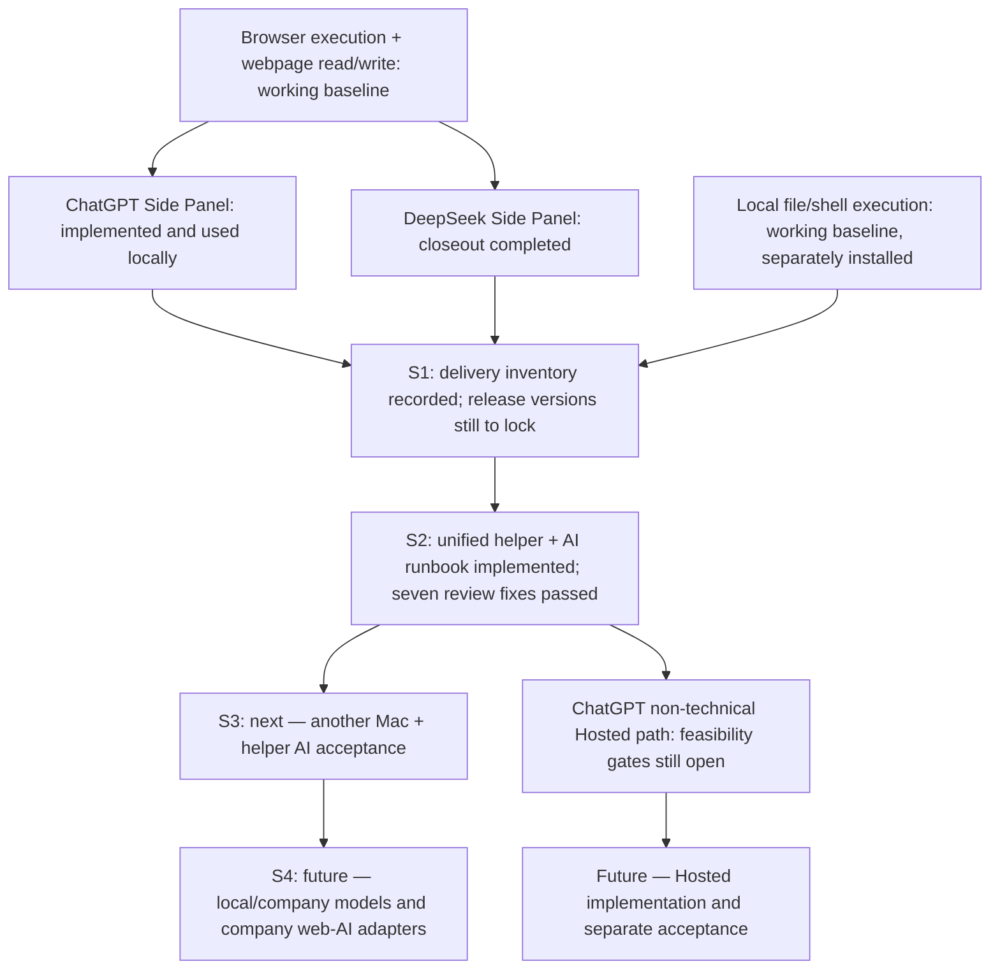

# Roadmap

## Delivery progress — 2026-09-21

Current focus: reproduce the working system on another Mac through the recipient's own terminal-capable AI, using the unified checks/download/diagnosis helper and [AI installation runbook](setup/INSTALL-FOR-AI.md). The helper delegates installation to each component's existing installer; it is not a second installer implementation.

- **Completed locally:** browser and local execution foundations, parallel ChatGPT/DeepSeek Side Panels, fixed extension IDs, delivery inventory, and the unified helper/runbook. DeepSeek closeout does not imply every real-site scenario has passed; see the [inventory's known limits](docs/release-inventory-v1.md).
- **Review passed:** installer-entry fixes at `1fc5c13`; Panel `npm run check` **125/125** in this review. The superseded Family Installer prototype was retired at `192374a`.
- **Next delivery gate:** an AI helper follows the runbook on another Mac. Record panel usability, connector health, model connection, and a real tool call separately; local tests are not evidence of this acceptance. Pin the released component versions, including the deferred DeepSeek installer version option.
- **Distribution follows A2:** DeepSeek first for non-technical users; ChatGPT Tunnel for technical users. ChatGPT via Hosted Relay is a separate unfinished path, including target-plan capability and local-coding design gates. Existing Browser MCP already works; S4 extends model compatibility rather than starting Browser execution from scratch.

The detailed implementation milestones below retain their own acceptance status. Governing decisions: [A1–A3](docs/architecture-decision-v1.md#9-amendments).

## Current — causal page handoff

Implemented in 1.0.0; pending real-browser acceptance.

The task is now a bounded browser session rather than only one immutable tab:

- same-tab navigation caused by a Browser WebMCP click can hand off to the new document;
- a new tab or popup is adopted only when Chrome reports the current task tab as its opener while a short WebMCP click handoff lease is active;
- unrelated user tab switches and cross-origin navigation never silently retarget the task;
- closing an adopted child page restores the nearest surviving parent task page;
- native browser/macOS dialogs remain outside webpage DOM authority and pause for owner action;
- the first implementation uses existing Chrome tabs/opener signals and adds no `webNavigation` permission.

## Current — richer page interaction

Implemented in 1.0.0; pending real-browser acceptance.

- page inspection exposes semantic links, rows, focusable/clickable elements and editable regions in addition to ordinary controls;
- safe navigation/view actions such as opening a mail row, Reply, Reply all, Forward, Open and View may execute automatically even when implemented using submit-like controls;
- `fill` supports `contenteditable` textbox regions used by webmail reply/composer bodies;
- commit-like actions such as Send, Pay, Delete, Submit, Purchase and similar actions remain confirmation-gated.

## Stable — minimal Side Panel chrome

The normal header contains only current task/page status and a conditional Stop action. Development/recovery shortcuts are not shown during normal operation. Closing the Side Panel releases the current Browser WebMCP session; the extension itself remains installed and event-driven.

## Current — native Browser MCP lifecycle

The old hidden conversation-text protocol and DOM repair layer are removed from runtime. Browser tools enter ChatGPT through the native MCP lifecycle:

`ChatGPT Web -> Secure MCP Tunnel -> thin Browser MCP server -> owner-only Unix socket -> Chrome Native Messaging -> service worker -> browser-client.js -> target-executor.js`.

The Browser MCP server exposes exactly six bounded page tools: `inspect_page`, `inspect_form`, `fill`, `select`, `click` and `scroll` (`scroll` added by amendment A4 in `docs/architecture-decision-v1.md`). The separate `webmcp-bridge` Base remains unchanged and continues to own local filesystem/bash access.

The embedded ChatGPT content script is now non-invasive: it only verifies the extension iframe, persists safe ChatGPT routes, and provides the Side Panel ready/ping handshake. It does not mutate conversation DOM, inject a browser-tool prompt harness, create continuation messages, hide Called tool rows, or collapse turns. ChatGPT Web owns Thinking/tool/final-answer presentation.

Live gate passed on 2026-09-20: the unpacked extension, dedicated Secure MCP Tunnel, Chrome Native Messaging host, and Browser MCP connector completed a real `inspect_page` call from the Embedded Panel using ChatGPT's native MCP lifecycle. The synthetic `<webmcp_tool_call>` path is no longer part of runtime.

## Stable — Browser MCP unattended lifecycle

The dedicated Browser tunnel LaunchAgent (`com.webmcp.browser-tunnel`) is installed and has passed a real macOS reboot/login acceptance on 2026-09-20.

Observed after reboot:

- `com.webmcp.native-tunnel`: `state = running`, `runs = 1`, fresh PID 1774, never exited;
- `com.webmcp.browser-tunnel`: `state = running`, `runs = 1`, fresh PID 1794, never exited;
- Browser `/readyz`: `ready`;
- `webmcp-browser-tunnel.err`: 0 bytes;
- both user LaunchAgents started after the new GUI login and showed no KeepAlive restart loop.

Therefore foreground Terminal ownership is no longer part of the normal Browser MCP runtime.

Local Expert / Privacy setup consolidation is now implemented in the working tree: `npm run local:setup`, `npm run local:doctor`, and `npm run local:uninstall`, with profile-mismatch checks before the first write and Browser-vs-Native ownership tests. Automated Local coverage is green; the remaining gate is one real idempotent setup rerun + doctor + real ChatGPT `inspect_page` on the owner's Mac. The canonical operator flow is in README.

## Next — Browser WebMCP Platform

The product roadmap now has three deployment tracks, documented in `docs/browser-webmcp-platform-roadmap.md`:

- **Hosted / Cloud:** vendor public MCP + authenticated WebSocket Relay + Chrome Extension for mainstream users.
- **Enterprise Private:** customer/private model + customer-hosted Relay + managed Extension inside the customer's trust boundary.
- **Local / Expert / Privacy:** the current Secure MCP Tunnel + local Browser MCP path for technical/privacy users.

All three must reuse the existing Browser Execution Plane (`browser-client.js`, task binding/handoff, and `target-executor.js`).

Priority order and the governing architecture are recorded in `docs/architecture-decision-v1.md` (2026-09-21), including amendments A1–A3: AI-assisted delivery and another-Mac acceptance, then additional model adapters. A2 makes Hosted a prerequisite for the non-technical ChatGPT path; it is not part of the completed local baseline. Hosted must still satisfy its feasibility gates and reviewed preconditions before implementation.
